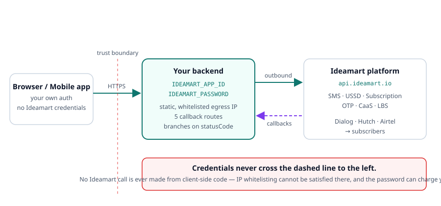

<p align="center">
  
</p>

<h1 align="center">Ideamart Skill for Agents</h1>

<p align="center">
  <em>Telco integrations your AI agent gets right the first time.</em>
</p>

<p align="center">
  <sub>by <strong>hSenid Mobile Solutions</strong> for <strong>Ideamart</strong></sub>
</p>

<p align="center">
  <a href="https://github.com/hSenidMobileCPaaS/Ideamart-as-a-Skill/actions/workflows/ci.yml"></a>
  <a href="LICENSE"></a>
  
  
  
  
  
</p>

<p align="center">
  <strong>SMS · USSD · Subscription · OTP · CaaS charging · LBS</strong><br>
  <sub>Dialog Axiata's Sri Lankan telco platform — operators Dialog, Hutch (072/078) and Airtel.</sub>
</p>

---

Ask an AI agent to integrate Ideamart today and it will confidently write
`if (response.ok) return "sent"`. Ideamart returns **HTTP 200 for failures**, so that line
reports every error as a success. It will also hardcode your `applicationId`, send
`destinationAddresses` as a string, and — if you let it near the charging API — retry a timed
out debit with a fresh transaction ID and charge someone twice.

None of that is the model being careless. It is the model not having the contract.

This repo gives it the contract: every endpoint, every parameter, every response field, every
status code, all five callbacks, and the handful of rules that separate a working integration
from a suspended one.

**In whatever language you already use.** Ideamart is JSON over HTTPS, so nothing here is tied
to one runtime:

- [**Every endpoint as a runnable curl**](references/13-curl-reference.md) — the request, every
  parameter defined, the response, every response field explained, and the same for all five
  callbacks. Translate it into the HTTP client you already use and you have the call. No SDK, no
  generated code, no language second-class.
- [**references/11-any-stack.md**](references/11-any-stack.md) specifies the integration around
  the calls language-neutrally — seven components, per-language notes, and an acceptance
  checklist — for Ruby, Rust, Kotlin, Elixir or anything else.
- [**templates/**](templates/README.md) shows the whole thing already built in TypeScript/Node,
  Python, Java, Go, PHP and C# — worked examples to read for shape, not output to paste.

There is deliberately **no code generator**. An emitter serves the languages someone wrote
emitters for and ages with each of their idioms; a curl is the same call everywhere and stays
true as long as the contract does.

---

## Install

Pick your agent. Everything below is the same content behind a different filename.

<details open>
<summary><strong>Claude Code</strong></summary>

```
/plugin marketplace add hSenidMobileCPaaS/Ideamart-as-a-Skill
```
```
/plugin install ideamart@ideamart
```

Or clone it as a skill directly:

```bash
git clone https://github.com/hSenidMobileCPaaS/Ideamart-as-a-Skill ~/.claude/skills/ideamart
```
</details>

<details>
<summary><strong>Cursor</strong></summary>

```bash
git clone https://github.com/hSenidMobileCPaaS/Ideamart-as-a-Skill .ideamart
cp .ideamart/.cursor/rules/ideamart.mdc .cursor/rules/
```
</details>

<details>
<summary><strong>Codex</strong></summary>

```bash
codex plugin marketplace add hSenidMobileCPaaS/Ideamart-as-a-Skill
codex plugin add ideamart@ideamart
```
</details>

<details>
<summary><strong>GitHub Copilot</strong></summary>

CLI:

```bash
copilot plugin marketplace add hSenidMobileCPaaS/Ideamart-as-a-Skill
```

Editor extension — copy the instructions file:

```bash
cp .ideamart/.github/copilot-instructions.md .github/
```
</details>

<details>
<summary><strong>Gemini CLI / Antigravity</strong></summary>

```bash
gemini extensions install https://github.com/hSenidMobileCPaaS/Ideamart-as-a-Skill
```
</details>

<details>
<summary><strong>Windsurf · Cline · Kiro · Qoder</strong></summary>

```bash
git clone https://github.com/hSenidMobileCPaaS/Ideamart-as-a-Skill .ideamart
cp .ideamart/.windsurf/rules/ideamart.md  .windsurf/rules/     # Windsurf
cp .ideamart/.clinerules/ideamart.md      .clinerules/         # Cline
cp .ideamart/.kiro/steering/ideamart.md   .kiro/steering/      # Kiro
cp .ideamart/.qoder/rules/ideamart.md     .qoder/rules/        # Qoder
```
</details>

<details>
<summary><strong>Aider · Zed · Amp · Jules · Junie · OpenCode · anything reading AGENTS.md</strong></summary>

```bash
git clone https://github.com/hSenidMobileCPaaS/Ideamart-as-a-Skill .ideamart
```

Then reference `.ideamart/AGENTS.md` from your own `AGENTS.md`, or copy it to the project root.
</details>

<details>
<summary><strong>No install — any assistant</strong></summary>

Paste the raw URL and ask it to read the file:

```
https://raw.githubusercontent.com/hSenidMobileCPaaS/Ideamart-as-a-Skill/main/AGENTS.md
```
</details>

Full matrix of what each agent reads: **[docs/agent-support.md](docs/agent-support.md)**.

---

## The part that makes it precise

Documentation alone still leaves an agent recalling parameter names from memory. So the whole
Ideamart contract also ships as **structured data** — [`catalog/ideamart-api.json`](catalog/ideamart-api.json) —
with a zero-dependency CLI over it that any agent can drive through its shell.

This is the capability an MCP server would give you, without running a server: no install, no
dependencies, no process to keep alive, and it works in every agent that can run a command.

```bash
$ node tools/ideamart.mjs show subscription-query-base

Query Base (subscriber base size)  (subscription-query-base)
Return the number of subscribers currently registered to the application.

  Endpoint  POST https://api.ideamart.io/subscription/query-base

  Request parameters
    applicationId   string   required
      Application ID as received when provisioned.
    password        string   required
      Password as received when provisioned.

  Response fields
    baseSize        Current subscriber base size. Arrives as a string — coerce before arithmetic.
    ...
```

| Command | Answers |
|---|---|
| `list [category]` | What services exist? |
| `show <id>` | What exactly does this call take and return? |
| `search "<query>"` | Which service does the thing I want? |
| `curl <id> [k=v]` | **Give me the call** — a runnable request, with the parameters and the response defined. |
| `validate <id> '<json>'` | Is this payload correct? |
| `code <statusCode>` | What does this error mean, and what do I do? |
| `diagnose "<symptom>"` | Why is this not working? |
| `practices [severity]` | What must I not get wrong? |
| `checklist` | Am I ready for production? |
| `reference <doc>` | Show me the full guide. |
| `platform` | Base URLs, operators, conventions. |

Add `--json` to any command for machine-readable output. Agents that cannot run commands — or
machines without Node — read the catalog JSON directly; same data, and `jq` or a one-line
Python snippet gets at it. The CLI is a documentation reader: it makes no network calls, never
sees a credential, and puts no constraint on the language your integration is written in.

It catches the real mistakes, not just missing fields:

```bash
$ node tools/ideamart.mjs validate sms-send '{"message":"hi","destinationAddresses":"tel:94771234567"}'

  ✗ 3 error(s)  against sms-send
    ✗ Missing required field "applicationId" — Application ID as given when provisioned.
    ✗ Missing required field "password" — Password given when provisioned.
    ✗ "destinationAddresses" must be an ARRAY, got string. This is the most common Ideamart integration bug.
```

### Every endpoint as curl — the path for any language

No SDK, no code generation, no Node: [references/13-curl-reference.md](references/13-curl-reference.md)
writes out all 11 endpoints and all 5 callbacks at the wire — the request, every parameter
defined, the response, every response field explained, and the status codes that endpoint can
return.

```bash
curl -sS -X POST "$IDEAMART_CAAS_DEBIT_URL" \
  -H 'Content-Type: application/json' \
  --max-time 15 \
  -d @- <<REQUEST
{
  "applicationId": "$IDEAMART_APP_ID",
  "password": "$IDEAMART_PASSWORD",
  "externalTrxId": "12345678901234567890123456789012",
  "subscriberId": "tel:94771234567",
  "amount": "1",
  "currency": "LKR"
}
REQUEST
```

| `externalTrxId` | **Required** | Your transaction ID. Max 32 characters. Persist BEFORE calling — it is the idempotency key. |
|---|---|---|
| `subscriberId` | **Required** | MSISDN or hash key of the subscriber to charge. |
| `amount` | **Required** | Amount to charge, sent as a string. Hold as a decimal type in your own code. |

Credentials come from the environment, so nothing on the page is a secret and nothing you copy
can commit one. The document is generated from the catalog and CI fails if it drifts, so a
Ruby, Rust, Kotlin or Elixir integration works from exactly the same contract as a TypeScript
one — and running a call by hand is the fastest way to tell a bad payload from bad code.

### Why there is no code generator

An earlier version of this repo shipped emitters for six languages. They were removed, on
purpose. A generator encodes *idiom*, not contract: the Ideamart contract barely moves, but
framework versions, HTTP-client conventions and language idioms move constantly, so the emitter
carries most of the maintenance while the contract carries most of the value. It also draws an
arbitrary line — the seventh language is a second-class citizen forever.

The curl reference has neither problem. It is generated from the catalog, verified in CI, and
equally correct for Kotlin, Elixir and Rust as for TypeScript. Modern coding agents write better
client code from a precise contract and a set of rules than any template can, because they write
in the host project's actual conventions.

What is kept current instead: the catalog, the curl reference, the status-code semantics, the
practices, and the diagnostics.

And it turns a symptom into a fix:

```bash
$ node tools/ideamart.mjs diagnose "works locally, fails in production"

  Likely cause
  The deployed server's egress IP is not whitelisted, or secrets are not set in the host environment.

  Fix
  Run curl -4 https://myip.ideamart.io ON THE DEPLOYED SERVER and add that IP to
  Allowed Host Addresses. Confirm IDEAMART_APP_ID and IDEAMART_PASSWORD are set in
  the host's secret manager.
```

---

## Configuration is two credentials and your enabled endpoints

An Ideamart application can only call the APIs it was provisioned for, so the configuration
mirrors that exactly — nothing else is environment-dependent:

```bash
IDEAMART_APP_ID=APP_XXXXXX
IDEAMART_PASSWORD=replace-me

# Uncomment only what is enabled on your application:
#IDEAMART_SMS_SEND_URL=https://api.ideamart.io/sms/send
#IDEAMART_SUBSCRIPTION_SEND_URL=https://api.ideamart.io/subscription/send
#IDEAMART_CAAS_DEBIT_URL=https://api.ideamart.io/caas/direct/debit
```

An unset endpoint is meaningful: the client refuses the call locally, so you get a clear error
naming the missing variable instead of `E1309` from the platform after a round trip. Pointing
one at a mock is the whole local-development switch.

Timeouts, encodings and retry policy are **not** configuration — they are constants in the
client, because they are properties of the protocol rather than of your deployment.

These variable names are identical across every language template, so a polyglot estate has one
deployment story.

## Architecture it steers agents toward

<p align="center">
  
</p>

---

## Coverage

| Service | Operations |
|---|---|
| **SMS** | Send (MT), broadcast to base, receive (MO), delivery status reports |
| **USSD** | Send screens, receive input, the `mo-init`/`mo-cont`/`mt-init`/`mt-cont`/`mt-fin` state machine |
| **Subscription** | Register (opt-in), **unregister (opt-out)**, status, **query base size**, notifications |
| **OTP** | Request, verify, masked-MSISDN handoff |
| **CaaS** | Direct debit, query balance, charging notifications, reconciliation |
| **LBS** | Get location, QoS precedence rules, privacy handling |
| **IVR** | Not publicly documented — documented as such, with an extension pattern |

### Languages

| Stack | What ships |
|---|---|
| TypeScript / Node | config, client, types, Next.js callback routes, USSD session store |
| Python | config, client, FastAPI callbacks, USSD session store (standard library only) |
| Java | config, client, Spring callback controller |
| Go | config, client, `net/http` callbacks (standard library only) |
| PHP | config, client, framework-neutral callbacks with Laravel notes |
| C# / .NET | options, typed client, ASP.NET Core callbacks + background worker |
| Anything else | [references/13-curl-reference.md](references/13-curl-reference.md) — every endpoint as curl, with definitions — plus [references/11-any-stack.md](references/11-any-stack.md) for the seven components, per-language notes and an acceptance checklist |

Plus the complete official status-code table, all five callback contracts, and the operational
practices that keep an application approved.

### Skills

| Skill | Use it for |
|---|---|
| `ideamart` | General Ideamart work; the rules and the service map |
| `ideamart-scaffold` | Starting a new integration |
| `ideamart-callbacks` | Inbound webhooks |
| `ideamart-review` | Auditing existing code |
| `ideamart-debug` | A failing call or callback |
| `ideamart-golive` | The pre-production checklist |
| `ideamart-help` | Quick reference |

On plugin-tier hosts these are also slash commands: `/ideamart`, `/ideamart-review`, and so on.

---

## What it actually changes

Nine mistakes agents make on this platform, and what each one costs:

| Mistake | Consequence |
|---|---|
| Deciding on the HTTP status (`res.ok`, `raise_for_status()`, `EnsureSuccessStatusCode()`) | Ideamart returns **HTTP 200 for errors**. Every failure reported as a success. |
| `destinationAddresses: "tel:94…"` | It is always an **array**. Sends fail. |
| Hardcoded `applicationId` / `password` | A credential that can charge your subscribers, committed to git. |
| `E1351` / `E1356` / `E1379` treated as failures | Working flows reported as broken; charges repeated. |
| Debit retried with a fresh `externalTrxId` | **Double-charges a real person.** |
| Self-generated USSD `sessionId` | Sessions orphan; the user's screen goes blank. |
| USSD sessions in an in-process map, whatever the language | Works in dev, breaks the moment you scale. |
| Work before acknowledging a callback | Sessions time out; duplicates pile up. |
| TLS verification switched off (`rejectUnauthorized: false`, `verify=False`, `InsecureSkipVerify`, …) | Your credentials become interceptable. |

---

## Quick start

```bash
# 1. Configure
cp templates/.env.example .env
$EDITOR .env                       # credentials, then uncomment ONLY the endpoints
                                   # for the APIs enabled on your application

# 2. Confirm your egress IP is whitelisted — run this ON THE SERVER
curl -4 https://myip.ideamart.io   # add the result to Allowed Host Addresses in the portal

# 3. Verify connectivity and credentials
./scripts/smoke-test.sh            # Windows: .\scripts\smoke-test.ps1

# 4. Test your callback handlers — no Ideamart account needed
./scripts/test-callbacks.sh http://localhost:3000
```

Then ask your agent:

> Add Ideamart subscription and SMS to this app — users opt in by SMS keyword, get a welcome
> message, and can text STOP to unsubscribe.

Starting from nothing, mid-build, or bolting Ideamart onto an app that already has users? The
A-to-Z route for each is [references/12-implementation-playbook.md](references/12-implementation-playbook.md).

---

## What's inside

```
SKILL.md · AGENTS.md              Entry points (Claude Code / everyone else)
catalog/ideamart-api.json         The whole contract as structured data
tools/ideamart.mjs                Offline CLI over the catalog
references/                       13 guides: per-service, callbacks, codes, security, go-live,
                                  the language-neutral spec, the A-to-Z playbook, and every
                                  endpoint as curl with its definitions
templates/                        .env.example + working config, client and callback handlers
                                  in TypeScript/Node, Python, Java, Go, PHP and C#
skills/ · commands/               7 task skills and their slash commands
scripts/                          Smoke tests (bash + PowerShell), callback tests, rule sync,
                                  curl-reference build
docs/agent-support.md             Which agent reads which file
```

---

## Development

```bash
npm test                                     # catalog + tooling tests
npm run check                                # tests + everything generated is in sync
node scripts/sync-rules.mjs                  # regenerate the agent rule copies
node scripts/build-curl-reference.mjs        # regenerate the curl reference
```

Two things are generated and CI fails if they drift: the seven agent rule files, from
`AGENTS.md`, and `references/13-curl-reference.md`, from `catalog/ideamart-api.json`. The test
suite verifies that every referenced status code exists, every parameter is fully specified,
every documented sample validates against its own schema, every endpoint and parameter appears
in the curl reference, and no credential-shaped string is committed.

See [CONTRIBUTING.md](CONTRIBUTING.md). Corrections to the API contract are the most valuable
contribution — cite the docs page or paste the observed response.

---

## Sources

Everything derives from the official documentation at
[docs.ideamart.io](https://docs.ideamart.io) — SMS, USSD, Subscription, OTP, Charging, LBS and
Response Codes — plus the IdeaPro provisioning guides, reconciled field by field against calls
verified working on a live application.

Where the two differ, the catalog records the call that works, so the skill gives one answer
rather than a caveat. That answer is the one the generator emits, the one `validate` checks
against, and the one the reference documents describe.

Ideamart evolves. Confirm with support what your application is actually provisioned for before
go-live, and open an issue if the platform's behaviour moves.

## Support

- **Email** — `info@ideamart.io`
- **WhatsApp** — +94767412345

Quote your `requestId` / `externalTrxId` / `sessionId` and the `statusCode` — that is what
support traces with.

## Security

No secrets in this repo; every credential is a placeholder and CI enforces it. The CLI makes
no network calls and never reads your credentials. See [SECURITY.md](SECURITY.md), and read
`scripts/smoke-test.*` before running it — `--with-charge` moves real money.

## Licence

**Proprietary.** Copyright © 2026 hSenid Mobile Solutions (Pvt) Ltd. All rights reserved.

This skill is the sole property of hSenid Mobile Solutions and is licensed for **use only**.
See [LICENSE](LICENSE) for the full terms.

| | |
|---|---|
| ✅ You may | Install it into your AI coding assistant and use it, unmodified, to build and operate your own Ideamart integrations. The integration code you produce is yours. |
| ❌ You may not | Copy it beyond what installation requires, modify it, publish or redistribute it, mirror or fork it, sublicense it, sell it, or bundle it into anything you sell. |

**Ideamart**, **hSenid Mobile**, their logos, "ideas that reach" and "co-creating the future"
are trademarks of hSenid Mobile Solutions (Pvt) Ltd. You may refer to Ideamart by name when
describing an integration you have built; you may not use the marks in your own product,
service or marketing.

For any permission beyond this — including modifying, redistributing or embedding the
skill — contact `info@ideamart.io`.

---

<p align="center">
  <a href="https://www.hsenidmobile.com">
    
  </a>
</p>

<p align="center">
  <sub>Built by <a href="https://www.hsenidmobile.com">hSenid Mobile Solutions</a> for
  <a href="https://ideamart.io">Ideamart</a>.</sub><br>
  <sub>The platform evolves — verify anything security- or billing-critical against
  <a href="https://docs.ideamart.io">docs.ideamart.io</a> before going live.</sub>
</p>
